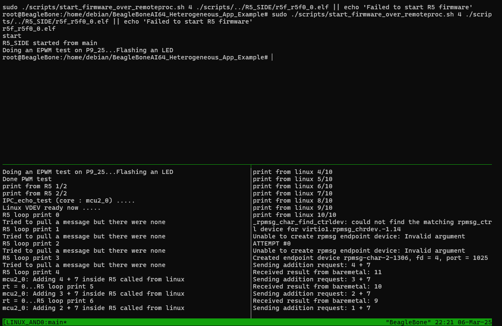

For this example to work, use beagle firmware with kernel 6.12. Make to to have the latest device tree overlay setup for 6.12.

Example started from Fred Eckert's example: https://github.com/FredEckert/bbai64_cortex-r5_example/tree/r5_toggle

### HOW TO RUN/SETUP
- To test quadrature encoder reading, connect IO P8_33<-->P8_34 and P8_35<-->P8-36.
- To see PWM work, connect an LED to P9_25.
- To see SPI7, connect a logic analyzer to P9_28 (CS), P9_31 (CLK) and P9_30 (MOSI).
- *SCROLL DOWN BELOW for build and execution instructions*


### Demonstrated Features
- **Remote Processor Resource Table Initialization**: Remote-proc resource table with trace log.
- **FPU Initialization for R5 Core**: TI AM64 sdk code...
- **MPU and Cache Configuration**: TI AM64 sdk code...
- **Exception and Interrupt Handling**: TI J721e SDK/PDK exception/interrupt handlers.
- **PWM Signal Generation**: Flashing LED on pin P9_25.
- **Rpmsg**: Basic Linux-R5 core communication (under development and a mess rn).
- **R5 SPI output**: SPI7 transfers on P9_28 (CS), P9_31 (CLK), P9_30 (MOSI).
- **R5 EQEP Encoder Reading**: Reading quadrature encoder EQEP_1 from R5 core.
- **R5 GPIO**: Shown with quadrature encoder simulation and bit-banged SPI.
- **R5 UART writing**: "Hello UART" prints from P9_16 (UART6_TX) at 19200 baud.

### Implemented but not used by test code yet
- **Shared Memory**: Linux-R5 memory sharing (`SHARED_CODE/include/shared_mem.h`, `SharedMemoryRegion* sharedMem`). **Warning**: 16-bit aligned reads/writes required to avoid crashes; standard `memcpy()` will crash.

### Planned
- **GPIO Linux**: Tested and working with `gpiod` library, need to write nice example code.
- **SPI Linux**: Tested, working; need to write nice example code.
- **UART Linux**: Tested, working; pending nice example code, symlink bug fix for 6.12 firmware.
- **I2C Linux**: Tested, working; need to write nice example code.
- **CAN Bus**: No progress.
- **R5 I2C**: Planned, stuck on interrupt routing issues (`R5_SIDE/r5_code/include/io_test_functions/i2c_tests.h`).
- **R5 UART reading**: Have not attempted yet.
- **R5 SPI reading**: Have not attempted yet.


If anybody wants to contribute random stuff, please do.


### Setup board
1. Grab debian 6.12 firmware. Flash the emmc, and also an sd card.
2. Flash emmc with https://www.beagleboard.org/distros/bbai64-debian-12-9-2025-03-05-minimal-flasher-v6-12-x-ti
3. Flash SD card with https://www.beagleboard.org/distros/bbai64-debian-12-9-2025-03-05-minimal-v6-12-x-ti
4. Power cycle board several times
5. Run `df -h` to ensure you are now booting from your SD card
6. Run this to get latest DT source among other important things `sudo apt update ; sudo apt-get dist-upgrade -y`
7. Compile and install custom_overlays/our-custom-bbai64-overlay.dtso (refer to "Device tree info")
8. Add the overlay `/overlays/our-custom-bbai64-overlay.dtbo` to `/boot/firmware/extlinux/extlinux.conf`
9. Power cycle the board several times
10. Verify overlay is loaded `sudo beagle-version | grep UBOOT`
11. Check if pins are muxed correctly `sudo ./scripts/show-pins.pl`
12. Enable SPI for use from linux with `sudo modprobe spidev`. (Currently this example does no SPI from linux)
13. Connect loop jumper wires P8_33<-->P8_34 and P8_35<-->P8-36 for EQEP_1 test.


### Setup and compile ti RTOS SDK
Make sure to use **Debian12** for building. It will make your life easier. On windows use WSL Debian 12.

1.  Run `wget https://dr-download.ti.com/software-development/software-development-kit-sdk/MD-bA0wfI4X2g/10.00.00.05/ti-processor-sdk-rtos-j721e-evm-10_00_00_05.tar.gz`
2.  Use `tar -xzf ti-processor-sdk-rtos-j721e-evm-10_00_00_05.tar.gz` to decompress
3.  Place decompressed sdk folder in ~/ti/
4.  Run `sudo apt install libtinfo5`  needed for ti sdk build

#### Build sdk/pdk:
1. Change to the directory `~/ti/ti-processor-sdk-rtos-j721e-evm-10_00_00_05/pdk_jacinto_10_00_00_27/packages` using `cd`.
2. 
    From the `packages` directory within the Jacinto PDK, run `make -s all_libs BUILD_PROFILE=release` to build the release libraries, and run `make -s all_libs BUILD_PROFILE=debug` to build the debug libraries.

    OPTIONAL:
    If you want to build the TI examples you may have to direct TI to also use the system compiler for some reason... You will also need to install the `mono-complete` package.

    For gcc arm to work install `arm-none-eabi-gcc`. Next setup the environment variables that TI uses to find the compiler. 
    - `export TOOLCHAIN_PATH_GCC=/usr`
    - `export TOOLCHAIN_PATH_GCC_ARCH64=/usr`
    - `export GCC_ARCH64_BIN_PREFIX=arm-none-eabi`

    Run `make all_examples CORE=mcu2_0` to compile examples. NOTE that `make all_examples` does not actually compile all examples, it only compiles the examples for mcu1_0. Some examples do not work with mcu1_0.

3.  The library release .a files are located at `~/ti/ti-processor-sdk-rtos-j721e-evm-10_00_00_05/pdk_jacinto_10_00_00_27/packages/ti/[LIBRARY]/lib/j721e/r5f/release`, and the debug files are at `~/ti/ti-processor-sdk-rtos-j721e-evm-10_00_00_05/pdk_jacinto_10_00_00_27/packages/ti/[LIBRARY]/lib/j721e/r5f/release/debug`.
    
    These ".a" files have an unusual extension, ".aer5f".


#### To build R5 code:
- Build TI sdk and place it at correct location as directed above.
- install `gcc-arm-none-eabi`
- Run `make` from folder with R5 makefile

#### To build Linux code:
```bash
sudo apt-get update
sudo apt-get install -y gcc-aarch64-linux-gnu g++-aarch64-linux-gnu
sudo dpkg --add-architecture arm64
sudo apt-get update
sudo apt-get install -y libgpiod-dev:arm64

make CROSSCOMPILE=true # default is to not cross compile
```

#### To build everything at once:
`[SCRIPT_DIR]/build_script.sh --beaglebone`

#### To build and copy to board:
`[SCRIPT_DIR]/compile_and_push.sh --ip [BEAGLE_IP]`

#### To run
`sudo [SCRIPT_DIR]/debug_run.sh`

### Device tree info
- Copy the overlays from our `custom_overlays/` folder to `/opt/source/dtb-6.12-Beagle/src/arm64/overlays` on the board.
- Run `git pull` from `/opt/source/dtb-6.12-Beagle` to get latest source.
- To compile overlays source on board run `sudo make clean` and `sudo make` from `/opt/source/dtb-6.12-Beagle`.
- To install the overlays, from `/opt/source/dtb-6.12-Beagle` run `sudo make arm64_install`.
- On the board, in the config file`/boot/firmware/extlinux/extlinux.conf`, replace the line `#fdtoverlays /overlays/<file>.dtbo` with `fdtoverlays /overlays/our-custom-bbai64-overlay.dtbo`
- Connect to debug uart and have fun. If things go bad you'll be down for some trial and error. You may end up re-flashing your board several times to recover it...

If your boot works correctly, you will see the following in your debug uart output on boot:
```
Retrieving file: /ti/k3-j721e-beagleboneai64.dtb
Retrieving file: /overlays/our-custom-bbai64-overlay.dtbo
## Flattened Device Tree blob at 88000000
   Booting using the fdt blob at 0x88000000
Working FDT set to 88000000
   Loading Device Tree to 000000008ffde000, end 000000008fffffff ... OK
Working FDT set to 8ffde000

```
#### Resources:

- You could make use of https://www.ti.com/tool/download/SYSCONFIG to figure out pin muxing when making your own overlays.
- v6.12.x-Beagle/src/arm64/ti/k3-j721e-main.dtsi is a very important file. If you want to use
some IO device that is not defined in here, you will have to dig into the TDA4VM TRM and write your equivalent fanciness in your own overlay. Defining power-domains, clocks, so on. For example for eqep...

- To figure out which SoC pad numbers go with which BB header pins, look at columns A and B
in the following spreadsheet. To figure out mux modes, look at row 10.
https://drive.google.com/file/d/15NLaUeMBy-iT8s6rFrP4Esf0Qh57T4xu/view?pli=1

- To figure out the addresses of SoC pads, look at table "Table 5-125. Pin Multiplexing" in the TDA4VM Processors datasheet
 https://www.ti.com/lit/ds/symlink/tda4vm.pdf?ts=1741890214437&ref_url=https%253A%252F%252Fwww.ti.com%252Fproduct%252FTDA4VM
 

#### Walkthrough of process to figure out muxing

From the spreadsheet we see that pad AC22 is the first pad on BB header pin P9_22. AC22 is thus known as P9_22a. The alternative
pad, U29, is known as P9_22b. From Looking at the TDA4VM datasheet, we see that AC22(aka P9_22a) has the address 0x00011C09C. For 
the J721E_IOPAD() pin-mux macro, we need the bottom 24bits of the address, so 0x09c, or 0x9c. 

To mux AC22(aka P9_22a) to be SPI6_CLK, as figured out from the spreadsheet, we need to set AC22 to mux-mode 4. And since
a SPI clock is an output signal, the pin should be put set to PIN_OUTPUT mode.
So `J721E_IOPAD(0x9c, PIN_OUTPUT, 4)`

We will also need to disable the second SoC pad that shares the same BB header pin. The SoC pad known as pin P9_22b, or 
pad U29. Using the same process as walked through with pad AC22, you get the following:
`J721E_IOPAD(0x170, PIN_DISABLE, 7)`

So to mux SPI6_CLK on BB pin P9_22:
```c
&main_pmx0 {
    whatever_name_you_feel: and-so-on-pins {
        pinctrl-single,pins = <
            J721E_IOPAD(0x9c, PIN_OUTPUT, 4) /* AC22, aka P9_22a */
            J721E_IOPAD(0x170, PIN_DISABLE, 7) /* U29, aka P9_22b */
            /* And so on for other pins... */
        >;
    };
};
```

**Side Note: You can use TI SysConfig for Pin Muxing**

TI SysConfig can aid the process of configuring pin muxing, but it comes with a couple of limitations you should be aware of when using it:

- **Conflicting Pads**: TI SysConfig does not automatically disable conflicting pads. These are SoC pads that share the same physical header pins on the BeagleBone as the pads you’re configuring. If conflicting pads remain enabled, there is potential for erratic behavior. Realisticaly, you'll be fine in most cases.

- **Signals with several pad options**: Make sure to explicitly select the correct SoC pad for each pin. Some signals have multiple SoC pad options. Normally only one of these options will go to the BB header. For example, with UART4_RXD, there are 3 options, pads AG28, P24, and W23. Ti SysConfig will by default pick the pad P24. Of these 3 pad options, AG28 is the only pad connected to the BB header. Look back at the pin mux spreadsheet linked above to figure out which SoC pads connect to which pins.

- **Default Pin Direction**: TI SysConfig sets all pin muxes to "PIN_INPUT" by default, even for pins that should be outputs. For example, for the SPI6_CLK pin config (which should be an output), TI SysConfig will by default generate `J721E_IOPAD(0x170, PIN_INPUT, 7)` instead of the correct `J721E_IOPAD(0x9c, PIN_OUTPUT, 4)`. PIN_INPUT gives the pin both RX and TX perms. PIN_OUTPUT only gives TX.


### Useful Commands

| Command                                           | Description                                  |
|---------------------------------------------------|----------------------------------------------|
| `sudo k3conf show clocks`                         | Displays all clock information.              |
| `sudo k3conf dump clocks <device ID>`             | Check status of clocks for device.           |
| `dmesg \| grep -i "reserved mem"`                 | Shows memory mapping information from logs.  |
| `sudo cat /proc/iomem`                            | More memory mapping info.                    |
| `sudo beagle-version \| grep UBOOT`               | Displays loaded device tree overlays.        |
| `ls /sys/devices/platform/bus@100000/`            | Devices that can now be used from linux???   |
| `dtc -I fs /sys/firmware/devicetree/base > dt.txt`| For dt debugging                             |
| `sudo journalctl -k`                              | View kernel logs                             |
| `sudo dmesg`                                      | View kernel logs                             |

### Useful Links

#### Documentation
- **[Pin Mappings](https://drive.google.com/file/d/15NLaUeMBy-iT8s6rFrP4Esf0Qh57T4xu/view)**: Pin mapping spreadsheet.
- **[Device and Clock IDs](https://software-dl.ti.com/tisci/esd/latest/5_soc_doc/j721e/clocks.html)**: TI documentation detailing device and clock IDs.
- **[TDA4VM Processor Page](https://www.ti.com/product/TDA4VM)**: Official TI page for the TDA4VM processor.
- **[TDA4VM TRM](https://www.ti.com/lit/zip/spruil1)**: Technical Reference Manual for the TDA4VM.
- **[TDA4VM datasheet](https://www.ti.com/lit/ds/symlink/tda4vm.pdf?ts=1747602249590)**: Useful for SoC pad/pin stuff.
- **[Cortex R5 TRM](https://developer.arm.com/documentation/ddi0460/d/?lang=en)**: Technical Reference Manual for the Cortex R5.
- **[TI RTOS SDK Documentation](https://software-dl.ti.com/jacinto7/esd/processor-sdk-rtos-jacinto7/latest/exports/docs/psdk_rtos/docs/user_guide/overview.html#)**: Overview of the TI RTOS SDK.
- **[TI PDK Documentation](https://software-dl.ti.com/jacinto7/esd/processor-sdk-rtos-jacinto7/latest/exports/docs/pdk_jacinto_10_01_00_25/docs/pdk_introduction.html#Documentation)**: Links to API guide and user guide.
- **[Processor SDK Linux Software Developer’s Guide](https://texasinstruments.github.io/processor-sdk-doc/processor-sdk-linux-J721E/esd/docs/11_00/devices/J7_Family/linux/index.html)**: Yet another source of documentation.
- **[UBoot documentation for the board](https://docs.u-boot.org/en/latest/board/beagle/j721e_beagleboneai64.html)**: How booting works.
- **[IPC for J721E](https://texasinstruments.github.io/processor-sdk-doc/processor-sdk-linux-J721E/esd/docs/11_00/linux/Foundational_Components_IPC_J721E.html)**: J721e sdk documentation explaining how IPC works.
- **[IPC workings explanation](https://software-dl.ti.com/mcu-plus-sdk/esd/AM64X/latest/exports/docs/api_guide_am64x/IPC_GUIDE.html)**: AM64X pdk documentation explaining how IPC works.
- **[TI AM64x MCU+ SDK Documentation](https://software-dl.ti.com/mcu-plus-sdk/esd/AM64X/latest/exports/docs/api_guide_am64x/index.html)**: Sometimes you can find gems here.


#### Tutorials
- **[Flashing eMMC](https://forum.beagleboard.org/t/ai-64-how-to-flash-emmc/32384)**: Forum guide on how to flash the eMMC on the BeagleBone AI-64.
- **[More on Flashing](https://forum.beagleboard.org/t/tda4vm-debian-11-3-flasher-does-not-produce-a-functional-emmc/33288)**: Additional forum discussion on flashing-related issues.

#### Debugging

- **[K3 OCD Guide](https://nmenon.github.io/k3ocd/)**: A guide on using OpenOCD for debugging on the BeagleBone AI-64.
- **[Debugging Options Forum Thread](https://forum.beagleboard.org/t/debugging-options-for-bbai64/33583/5)**: A discussion on various debugging options available for the BeagleBone AI-64.
- **[YouTube Debugging Tutorial](https://www.youtube.com/watch?v=n3u3QgnAvV8)**: A video tutorial covering debugging techniques.
- **[OpenOCD Config Issue](https://git.beagleboard.org/beagleboard/beaglebone-ai-64/-/issues/31)**: Issue tracker for OpenOCD configuration specific to the BeagleBone AI-64.

#### Work by others:
- This guy is doing PRU and DSP stuff
https://github.com/loic-fejoz/beaglebone-ai64-tutorial

- C7x DSP
https://github.com/willtoth/bbai64_c7x_example

- Using SDK10 with kernel 6.6 for R5 (These guys are using the TI build system)
https://forum.beagleboard.org/t/bbai64-now-can-use-ti-sdk10-0-and-debug-r5/39459

- Zephyr (currently work in progress)
https://docs.zephyrproject.org/latest/boards/beagle/beaglebone_ai64/doc/index.html

#### Other
- **[The PRU Development Kit](https://git.ti.com/cgit/pru-software-support-package/pru-software-support-package/)**: TI’s PRU software support package for development.
- **[Beagle Images](https://www.beagleboard.org/distros)**: Release images.
- **[Random Beagle Images](https://rcn-ee.com/rootfs/)**: Random images.


