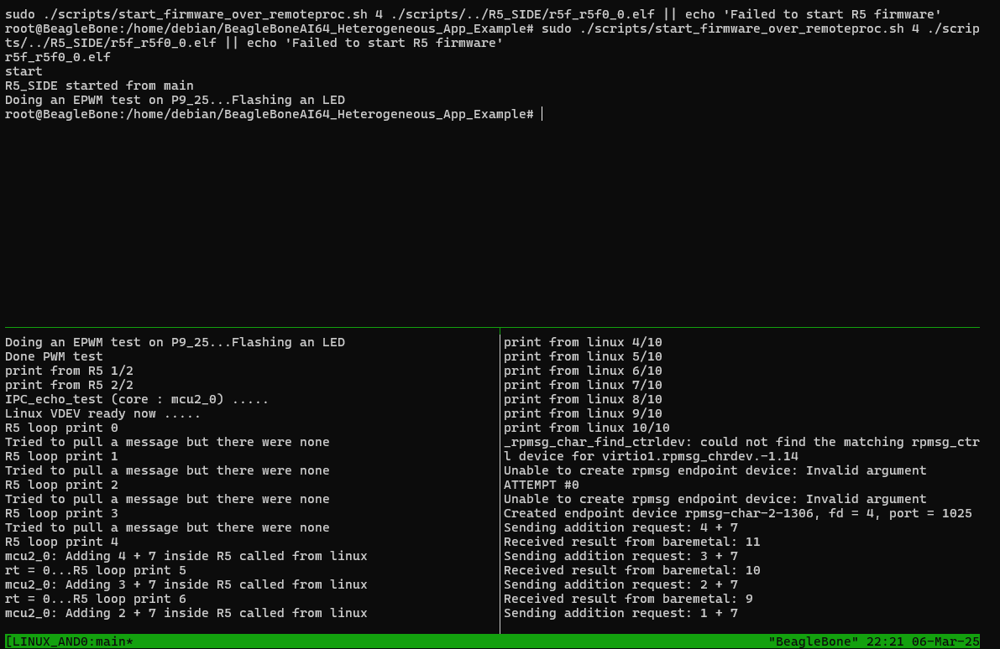

For this example to work, use a **recent BeagleBoard.org Debian image with a newer TI 6.12 kernel** (`v6.12.x-ti`). R5 remoteproc stop/restart needs the graceful `RP_MBOX_SHUTDOWN` / ACK path in that kernel — older kernels may not have this.

Recommended images:
- **eMMC flasher:** [BBAI64 Debian 13.3 2026-02-12 Minimal Flasher (v6.12.x-ti)](https://www.beagleboard.org/distros/bbai64-debian-13-3-2026-02-12-minimal-flasher-v6-12-x-ti)
- **SD card / runtime:** [BBAI64 Debian 13.5 2026-05-19 Minimal (v6.12.x-ti)](https://www.beagleboard.org/distros/bbai64-debian-13-5-2026-05-19-minimal-v6-12-x-ti)

Example started from Fred Eckert's example: https://github.com/FredEckert/bbai64_cortex-r5_example/tree/r5_toggle

### HOW TO RUN/SETUP
- To test quadrature encoder reading, connect IO P8_33<-->P8_34 and P8_35<-->P8-36.
- To see PWM work, connect an LED to P9_25.
- To see PRU0_0 RPMsg LED blinks, connect an LED to **P8_11**.
- To see SPI7, connect a logic analyzer to P9_28 (CS), P9_31 (CLK) and P9_30 (MOSI).
- To try the R5 UART polling self-test, connect P9_16 (UART6_TX) to P8_28 (UART8_RX).
- *SCROLL DOWN BELOW for build and execution instructions*


### Demonstrated Features
- **Remote Processor Resource Table Initialization**: Remote-proc resource table with trace log.
- **FPU Initialization for R5 Core**: TI AM64 sdk code...
- **MPU and Cache Configuration**: TI AM64 sdk code...
- **Exception and Interrupt Handling**: TI J721e SDK/PDK exception/interrupt handlers.
- **PWM Signal Generation**: Flashing LED on pin P9_25.
- **Rpmsg**: Basic Linux-R5 core communication with RPMSG, cross core function calling.
- **PRU0_0 hello + RPMsg LED**: `PRU0_0_SIDE/` — remoteproc trace hello-world, and blink-count on P8_11 via `rpmsg_char` / `/dev/rpmsgN` (build with `./scripts/build.sh --pru`).
- **R5 SPI output**: SPI7 transfers on P9_28 (CS), P9_31 (CLK), P9_30 (MOSI).
- **R5 EQEP Encoder Reading**: Reading quadrature encoder EQEP_1 from R5 core.
- **R5 GPIO**: Shown with quadrature encoder simulation and bit-banged SPI.
- **R5 UART TX, and polling RX**: P9_16 (UART6_TX) to P8_28 (UART8_RX) polling example.

### Implemented but not used by test code yet
- **Shared Memory**: Linux-R5 memory sharing (`SHARED_CODE/include/shared_mem.h`, `SharedMemoryRegion* sharedMem`). **Warning**: 16-bit aligned reads/writes required to avoid crashes; standard `memcpy()` will crash.

### Planned
- **RTU0_0 + PRU0_0 split**: Move RPMsg onto `RTU0_0_SIDE/` (like loic example-05); keep pin timing on PRU0_0.
- **GPIO Linux**: Tested and working with `gpiod` library, need to write nice example code.
- **SPI Linux**: Tested, working; need to write nice example code.
- **UART Linux**: Tested, working; pending nice example code, symlink bug fix for 6.12 firmware.
- **I2C Linux**: Tested, working; need to write nice example code.
- **CAN Bus**: No progress.
- **R5 I2C**: Planned, stuck on interrupt routing issues (`R5_SIDE/r5_code/include/io_test_functions/i2c_tests.h`).
- **R5 SPI reading**: Have not attempted yet.


If anybody wants to contribute random stuff, please do.


### Setup board
1. Grab a recent Beagle Debian **v6.12.x-ti** image, flash the eMMC, and also an SD card.
2. Flash eMMC with the [Debian 13.3 Minimal Flasher](https://www.beagleboard.org/distros/bbai64-debian-13-3-2026-02-12-minimal-flasher-v6-12-x-ti)
3. Flash SD card with the [Debian 13.5 Minimal](https://www.beagleboard.org/distros/bbai64-debian-13-5-2026-05-19-minimal-v6-12-x-ti) runtime image
4. Power cycle board several times
5. Run `df -h` to ensure you are now booting from your SD card
6. Run this to get a newer TI kernel / DT packages among other important things: `sudo apt update ; sudo apt-get dist-upgrade -y`
7. Run `sudo systemctl mask serial-getty@ttyGS0.service` to get around bug where sometimes uart debug login does not show up.
8. Compile and install custom_overlays/our-custom-bbai64-overlay.dtso (refer to "Device tree info")
9. Add the overlay `/overlays/our-custom-bbai64-overlay.dtbo` to `/boot/firmware/extlinux/extlinux.conf`
10. Power cycle the board several times
11. Verify overlay is loaded `sudo beagle-version | grep UBOOT`
12. Check if pins are muxed correctly `sudo ./scripts/show-pins.pl`
13. Enable SPI for use from linux with `sudo modprobe spidev`. (Currently this example does no SPI from linux)
14. Connect loop jumper wires P8_33<-->P8_34 and P8_35<-->P8-36 for EQEP_1 test.


### Setup and build (container-first)

All builds run inside **Podman** or **Docker** using two images:

| Image | Used for |
|-------|----------|
| `localhost/debian13-bbai64-build:latest` | Linux aarch64 cross-build (gpiod v2) |
| `localhost/ti-bbai64-build:latest` | R5 firmware, TI SDK, PDK libraries |

See [`docker/README.md`](docker/README.md) for details on why two images are used.

**Requirements:** Podman or Docker on the host. No host-installed cross-compilers required.

#### One-time setup (SDK/PDK + PSSP)

Processor SDK RTOS **11.02.01.03** for J721E, plus the PRU Software Support Package:

```bash
# Downloads ~3 GB SDK to ~/ti, builds PDK debug+release libs, and fetches/builds PSSP
./scripts/build.sh --setup
```

Manual SDK URL if needed:
`https://dr-download.ti.com/software-development/software-development-kit-sdk/MD-bA0wfI4X2g/11.02.01.03/ti-processor-sdk-rtos-j721e-evm-11_02_01_03.tar.gz`

After extract, the SDK lives at:
`~/ti/ti-processor-sdk-rtos-j721e-evm-11_02_01_03/pdk_jacinto_*`

PDK libraries used by this project (`.aer5f` extension), under both `debug` and `release` profiles:
`~/ti/ti-processor-sdk-rtos-j721e-evm-11_02_01_03/pdk_jacinto_*/packages/ti/[LIBRARY]/lib/j721e/...`

PSSP is cloned to `~/ti/pru-software-support-package/` (next to the SDK) and `lib/rpmsg_lib.lib` is built there.

#### Build commands

```bash
# After --setup: build Linux + R5 + PRU
./scripts/build.sh --all

# Individual targets (after --setup)
./scripts/build.sh --linux
./scripts/build.sh --r5
./scripts/build.sh --pru      # PRU0_0 hello + rpmsg_led (same TI container as --r5)

# Release-flavored application + matching PDK release libs
./scripts/build.sh --all --release

# Clean artifacts
./scripts/build.sh --clean --all
./scripts/build.sh --clean --pru
```

PRU firmware outputs: `build/PRU0_0/pru0_0-hello.out`, `build/PRU0_0/pru0_0-rpmsg-led.out`.
On the board: `sudo ./scripts/debug_pru0_0.sh start hello` (or `rpmsg_led`). See [`PRU0_0_SIDE/README.md`](PRU0_0_SIDE/README.md).

`BUILD_MODE` affects compiler flags for both Linux and R5 **application** sources, and for R5 also selects the matching PDK library profile for most drivers:
- `debug` (default): `-Og -g3` for Linux, `-g3 -Og` for R5, links PDK **debug** `.aer5f` libs where available
- `release`: `-O3 -DNDEBUG` for both, links PDK **release** `.aer5f` libs

Note: TI only builds sciclient and IPC for `mcu2_0` under the **release** profile, so those two always link from `.../release/` even in a debug app build.

`--setup` / `--build-pdk` build **both** PDK profiles so either mode can link. `--setup` also fetches PSSP and builds `rpmsg_lib`.

There is no supported x86 local-run build for this example app. The Linux build target is the BeagleBone `aarch64` binary.

#### Optional: rebuild PDK libraries only

```bash
./scripts/build.sh --build-pdk
```

Use a custom SDK location:

```bash
./scripts/build.sh --r5 --ti-sdk-dir /path/to/ti
```

The SDK directory must be writable by your user (required for `--fetch-sdk`) and must contain the extracted SDK folder (do not use symlinks that point outside the mounted directory).

```bash
sudo chown -R "$(id -u):$(id -g)" ~/ti
```

#### To build and copy to board:
`[SCRIPT_DIR]/compile_and_push.sh --ssh [SSH_DEST]`

`SSH_DEST` is an SSH host alias from `~/.ssh/config` (e.g. `bbai64`) or `user@host` (e.g. `kevinc@192.168.7.2`).

#### To run:
`sudo [SCRIPT_DIR]/debug_run.sh` (RUN FROM BOARD, NOT YOUR DEV MACHINE!)

#### R5 start/stop/restart (Linux 6.12)

On a **newer TI 6.12 kernel**, remoteproc stop is not a hard halt: Linux sends `RP_MBOX_SHUTDOWN`, waits for `RP_MBOX_SHUTDOWN_ACK`, then expects the R5 to enter WFI. This firmware implements that path. If stop times out with `can't stop rproc: -16`, the core never ACKed (or the board kernel is too old).

Readiness for reconnect is simple: Linux watches remoteproc sysfs (`running`), waits a short grace period, opens RPMSG, and pings once. When R5 goes away, the client abandons the fd without `RPMSG_DESTROY_EPT` (avoids a known 6.12 `rpmsg_char` race). There is no shared-memory lifecycle handshake.

R5 and Linux restart independently.

```bash
# Combined session (tmux LINUX_AND_R5):
sudo ./scripts/debug_run.sh                 # launch + attach
sudo ./scripts/debug_run.sh restart-r5      # R5 only
sudo ./scripts/debug_run.sh restart-linux   # Linux only
sudo ./scripts/debug_run.sh status
sudo ./scripts/debug_run.sh stop-session    # tmux only; leaves R5 running

# Or control each side directly (also fine while the combined session is up):
sudo ./scripts/debug_r5.sh start|stop|restart|status
sudo ./scripts/debug_linux.sh start|stop|restart|status
```

Quick verify: idle `debug_r5.sh start → stop → start → stop` with `status` showing `offline` and no `-16` in dmesg. Trace should show `SHUTDOWN_ACK status=0`. Linux can stay running across those R5 restarts.

### Device tree info
- Copy the overlays from our `custom_overlays/` folder to `/opt/source/dtb-6.12-Beagle/src/arm64/overlays` on the board.
- Run `git pull` from `/opt/source/dtb-6.12-Beagle` to get latest source.
- To compile overlays source on board run `sudo make clean` and `sudo make` from `/opt/source/dtb-6.12-Beagle`.
- To install the overlays, from `/opt/source/dtb-6.12-Beagle` run `sudo make arm64_install`.
- On the board, in the config file`/boot/firmware/extlinux/extlinux.conf`, replace the line `#fdtoverlays /overlays/<file>.dtbo` with `fdtoverlays /overlays/our-custom-bbai64-overlay.dtbo`
- Connect to debug uart and have fun. If things go bad you'll be down for some trial and error. You may end up re-flashing your board several times to recover it...

If your boot works correctly, you will see the following in your debug uart output on boot:
```
Retrieving file: /ti/k3-j721e-beagleboneai64.dtb
Retrieving file: /overlays/our-custom-bbai64-overlay.dtbo
## Flattened Device Tree blob at 88000000
   Booting using the fdt blob at 0x88000000
Working FDT set to 88000000
   Loading Device Tree to 000000008ffde000, end 000000008fffffff ... OK
Working FDT set to 8ffde000

```

- **Alteratively**, you may simply run the `custom_overlays/setup_dtb.sh` script on your AI64 and have anything done automatically. Be 
warned, `setup_dtb.sh` will replace the `/boot/firmware/extlinux/extlinux.conf` config file on your board. There is potential for breakage.
#### Resources:

- You could make use of https://www.ti.com/tool/download/SYSCONFIG to figure out pin muxing when making your own overlays.
- v6.12.x-Beagle/src/arm64/ti/k3-j721e-main.dtsi is a very important file. If you want to use
some IO device that is not defined in here, you will have to dig into the TDA4VM TRM and write your equivalent fanciness in your own overlay. Defining power-domains, clocks, so on. For example for eqep...

- To figure out which SoC pad numbers go with which BB header pins, look at columns A and B
in the following spreadsheet. To figure out mux modes, look at row 10.
https://drive.google.com/file/d/15NLaUeMBy-iT8s6rFrP4Esf0Qh57T4xu/view?pli=1

- To figure out the addresses of SoC pads, look at table "Table 5-125. Pin Multiplexing" in the TDA4VM Processors datasheet
 https://www.ti.com/lit/ds/symlink/tda4vm.pdf?ts=1741890214437&ref_url=https%253A%252F%252Fwww.ti.com%252Fproduct%252FTDA4VM
 

#### Walkthrough of process to figure out muxing

From the spreadsheet we see that pad AC22 is the first pad on BB header pin P9_22. AC22 is thus known as P9_22a. The alternative
pad, U29, is known as P9_22b. From Looking at the TDA4VM datasheet, we see that AC22(aka P9_22a) has the address 0x00011C09C. For 
the J721E_IOPAD() pin-mux macro, we need the bottom 12bits of the address, so 0x09c, or 0x9c. 

To mux AC22(aka P9_22a) to be SPI6_CLK, as figured out from the spreadsheet, we need to set AC22 to mux-mode 4. And since
a SPI clock is an output signal, the pin should be put set to PIN_OUTPUT mode.
So `J721E_IOPAD(0x9c, PIN_OUTPUT, 4)`

We will also need to disable the second SoC pad that shares the same BB header pin. The SoC pad known as pin P9_22b, or 
pad U29. Using the same process as walked through with pad AC22, you get the following:
`J721E_IOPAD(0x170, PIN_DISABLE, 7)`

So to mux SPI6_CLK on BB pin P9_22:
```c
&main_pmx0 {
    whatever_name_you_feel: and-so-on-pins {
        pinctrl-single,pins = <
            J721E_IOPAD(0x9c, PIN_OUTPUT, 4) /* AC22, aka P9_22a */
            J721E_IOPAD(0x170, PIN_DISABLE, 7) /* U29, aka P9_22b */
            /* And so on for other pins... */
        >;
    };
};
```

**Side Note: You can use TI SysConfig for Pin Muxing**

TI SysConfig can aid the process of configuring pin muxing, but it comes with a couple of limitations you should be aware of when using it:

- **Conflicting Pads**: TI SysConfig does not automatically disable conflicting pads. These are SoC pads that share the same physical header pins on the BeagleBone as the pads you’re configuring. If conflicting pads remain enabled, there is potential for erratic behavior. Realisticaly, you'll be fine in most cases.

- **Signals with several pad options**: Make sure to explicitly select the correct SoC pad for each pin. Some signals have multiple SoC pad options. Normally only one of these options will go to the BB header. For example, with UART4_RXD, there are 3 options, pads AG28, P24, and W23. Ti SysConfig will by default pick the pad P24. Of these 3 pad options, AG28 is the only pad connected to the BB header. Look back at the pin mux spreadsheet linked above to figure out which SoC pads connect to which pins.

- **Default Pin Direction**: TI SysConfig sets all pin muxes to "PIN_INPUT" by default, even for pins that should be outputs. For example, for the SPI6_CLK pin config (which should be an output), TI SysConfig will by default generate `J721E_IOPAD(0x170, PIN_INPUT, 7)` instead of the correct `J721E_IOPAD(0x9c, PIN_OUTPUT, 4)`. PIN_INPUT gives the pin both RX and TX perms. PIN_OUTPUT only gives TX.

### Debugging R5:
---
You can debug using OpenOCD with GDB. If configured correctly, you could even do graphical
debugging with VScode. At some point there will be more detailed instructions here.

Some useful links:
- Very helpful video https://www.youtube.com/watch?v=n3u3QgnAvV8
- Debug prob setup, random info https://nmenon.github.io/k3ocd/#j721e-beaglebone-ai64
- OpenOCD config is here https://git.beagleboard.org/beagleboard/beaglebone-ai-64/-/issues/31
- OpenOCD and GDB setup and install https://u-boot.readthedocs.io/en/latest/board/ti/k3.html#common-debugging-environment-openocd
- https://forum.beagleboard.org/t/debugging-options-for-bbai64/33583/5
- https://forum.beagleboard.org/t/minimal-cortex-r5-example-on-bbai-64/32443/10


#### Debug from WSL Debian environment connected to TIAO USB JTAG prob:
- Setup WSL Debian https://www.microsoft.com/store/productId/9MSVKQC78PK6?ocid=pdpshare
- Install usbipd from PowerShell `winget install usbipd`
- Either use the usbipd cli or the vscode extension to connected debug prob to WSL https://marketplace.visualstudio.com/items?itemName=thecreativedodo.usbip-connect

    After successful forwarding to WSL you should see the following when you run lsusb
    ```bash
        kevin@computer-name:~/openocd$ lsusb
        Bus 002 Device 001: ID 1d6b:0003 Linux Foundation 3.0 root hub
        Bus 001 Device 002: ID 0403:6010 Future Technology Devices International, Ltd FT2232C/D/H Dual UART/FIFO IC
        Bus 001 Device 001: ID 1d6b:0002 Linux Foundation 2.0 root hub
    ```

-  Install dependencies
    ```bash
    sudo apt-get install libtool pkg-config texinfo libusb-dev libusb-1.0.0-dev libftdi-dev libhidapi-dev autoconf automake lsusb
    ```

-  Install and configure OpenOCD
    ```bash
    git clone https://github.com/openocd-org/openocd.git openocd
    cd openocd
    git submodule init
    git submodule update
    ./bootstrap
    ./configure --prefix=/usr/local/
    make -j`nproc`
    sudo make install
    ```
-   Start OpenOCD

    From `~/bla bla bla/openocd/tcl` run `sudo ../src/openocd -f [path folder with config]/ti_bbai64.cfg` to start OpenOCD using the BBAI64 config. OpenOCD will then tell you the ports for which it is hosting GDB's servers. There is a separate GDB server hosted for each core.

    If you get the error `Error: Invalid ACK (0) in DAP response` jiggle your connection to the board back and forth.

#### Self Hosted debugging (No physical debug prob):
note: **NOT SURE IF THIS HAS BEEN TESTED OR PROVEN TO WORK...**
- Install dependencies on BeagleBone
    ```bash
    sudo apt-get install libtool pkg-config texinfo libusb-dev libusb-1.0.0-dev libftdi-dev libhidapi-dev autoconf automake
    ```

- Install and configure OpenOCD on BeagleBone
    ```bash
    git clone https://github.com/openocd-org/openocd.git openocd
    cd openocd
    git submodule init
    git submodule update
    ./bootstrap
    ./configure --enable-dmem --prefix=/usr/local/
    make -j`nproc`
    sudo make install
    ```
- Copy the udev rules to the correct system location on BeagleBone
    ```bash
    sudo cp ./contrib/60-openocd.rules ./src/jtag/drivers/libjaylink/contrib/99-libjaylink.rules /etc/udev/rules.d/
    sudo udevadm control --reload-rules
    sudo udevadm trigger
    ```

Make sure BeagleBone bootloader firmware version is `8.6.3` or greater. This can be checked
with `sudo k3conf dump processor`.

From `~/bla bla bla/openocd/tcl` run `sudo ../src/openocd -f ./board/ti_j721e_swd_native.cfg` to start OpenOCD. OpenOCD will then tell you the ports for which it is hosting GDB servers. 

#### Using GDB:
Connect to GDB server for core on local port #### `gdb-multiarch -ex 'target extended-remote localhost:####' -ex 'set arch armv7' -ex 'file ~/PATH_TO_ELF/r5f_r5f0_0.elf'`. OpenOCD will tell you which cores are on which ports.

That ELF in that last option `-ex 'file ~/PATH_TO_ELF/r5f_r5f0_0.elf'` should be the same as the ELF currently running on the 
core that you're planning to debug. GDB uses the debug info from that ELF. Without the debug info you would be lost looking at bare assembly.

**WARNING**, MAKE SURE THAT THE ELF THAT YOU USE FOR DEBUG INFO IS THE SAME... In other words, if the ELF that you are running was compiled on the Beaglebone, DO NOT use an ELF you compiled on your development machine for debug info.


The debugger can only connect to a core while it is on and not in a halted/crashed state. When debugging broken firmware, after each crash you may need to start the R5 core into a nice clean state from linux with remoteproc. Make sure to alway have a working firmware on hand for core startup and reset. 

When the BeagleBone starts up, the R5 cores are in some halted state and thus can not be connected to by OpenOCD/GDB.

#### Using VScode with GDB for a graphic debugging experience:
Know that this is possible, the instructions will be written at some point. VScode setup is slightly covered in this
video https://www.youtube.com/watch?v=n3u3QgnAvV8.


### Useful Commands

| Command                                           | Description                                  |
|---------------------------------------------------|----------------------------------------------|
| `sudo k3conf show clocks`                         | Displays all clock information.              |
| `sudo k3conf dump clocks <device ID>`             | Check status of clocks for device.           |
| `dmesg \| grep -i "reserved mem"`                 | Shows memory mapping information from logs.  |
| `sudo cat /proc/iomem`                            | More memory mapping info.                    |
| `sudo beagle-version \| grep UBOOT`               | Displays loaded device tree overlays.        |
| `ls /sys/devices/platform/bus@100000/`            | Devices that can now be used from linux???   |
| `dtc -I fs /sys/firmware/devicetree/base > dt.txt`| For dt debugging                             |
| `sudo journalctl -k`                              | View kernel logs                             |
| `sudo dmesg`                                      | View kernel logs                             |

### Useful Links

#### Documentation
- **[Pin Mappings](https://drive.google.com/file/d/15NLaUeMBy-iT8s6rFrP4Esf0Qh57T4xu/view)**: Pin mapping spreadsheet.
- **[Device and Clock IDs](https://software-dl.ti.com/tisci/esd/latest/5_soc_doc/j721e/clocks.html)**: TI documentation detailing device and clock IDs.
- **[TDA4VM Processor Page](https://www.ti.com/product/TDA4VM)**: Official TI page for the TDA4VM processor.
- **[TDA4VM TRM](https://www.ti.com/lit/zip/spruil1)**: Technical Reference Manual for the TDA4VM.
- **[TDA4VM datasheet](https://www.ti.com/lit/ds/symlink/tda4vm.pdf?ts=1747602249590)**: Useful for SoC pad/pin stuff.
- **[Cortex R5 TRM](https://developer.arm.com/documentation/ddi0460/d/?lang=en)**: Technical Reference Manual for the Cortex R5.
- **[TI RTOS SDK Documentation](https://software-dl.ti.com/jacinto7/esd/processor-sdk-rtos-jacinto7/latest/exports/docs/psdk_rtos/docs/user_guide/overview.html#)**: Overview of the TI RTOS SDK.
- **[TI PDK Documentation](https://software-dl.ti.com/jacinto7/esd/processor-sdk-rtos-jacinto7/latest/exports/docs/pdk_jacinto_11_01_00_17/docs/pdk_introduction.html#Documentation)**: Links to API guide and user guide.
- **[Processor SDK Linux Software Developer’s Guide](https://texasinstruments.github.io/processor-sdk-doc/processor-sdk-linux-J721E/esd/docs/11_00/devices/J7_Family/linux/index.html)**: Yet another source of documentation.
- **[UBoot documentation for the board](https://docs.u-boot.org/en/latest/board/beagle/j721e_beagleboneai64.html)**: How booting works.
- **[IPC for J721E](https://texasinstruments.github.io/processor-sdk-doc/processor-sdk-linux-J721E/esd/docs/11_00/linux/Foundational_Components_IPC_J721E.html)**: J721e sdk documentation explaining how IPC works.
- **[IPC workings explanation](https://software-dl.ti.com/mcu-plus-sdk/esd/AM64X/latest/exports/docs/api_guide_am64x/IPC_GUIDE.html)**: AM64X pdk documentation explaining how IPC works.
- **[TI AM64x MCU+ SDK Documentation](https://software-dl.ti.com/mcu-plus-sdk/esd/AM64X/latest/exports/docs/api_guide_am64x/index.html)**: Sometimes you can find gems here.


#### Tutorials
- **[Flashing eMMC](https://forum.beagleboard.org/t/ai-64-how-to-flash-emmc/32384)**: Forum guide on how to flash the eMMC on the BeagleBone AI-64.
- **[More on Flashing](https://forum.beagleboard.org/t/tda4vm-debian-11-3-flasher-does-not-produce-a-functional-emmc/33288)**: Additional forum discussion on flashing-related issues.

#### Debugging

- **[K3 OCD Guide](https://nmenon.github.io/k3ocd/)**: A guide on using OpenOCD for debugging on the BeagleBone AI-64.
- **[Debugging Options Forum Thread](https://forum.beagleboard.org/t/debugging-options-for-bbai64/33583/5)**: A discussion on various debugging options available for the BeagleBone AI-64.
- **[Debugging Tutorial](https://www.youtube.com/watch?v=n3u3QgnAvV8)**: A video tutorial covering debugging techniques.
- **[OpenOCD Debug Setup](https://git.beagleboard.org/beagleboard/beaglebone-ai-64/-/issues/31)**: OpenOCD and debug hardware configuration.

#### Work by others:
- This guy is doing PRU and DSP stuff
https://github.com/loic-fejoz/beaglebone-ai64-tutorial

- C7x DSP
https://github.com/willtoth/bbai64_c7x_example

- Using SDK10 with kernel 6.6 for R5 (These guys are using the TI build system)
https://forum.beagleboard.org/t/bbai64-now-can-use-ti-sdk10-0-and-debug-r5/39459

- Zephyr (currently work in progress)
https://docs.zephyrproject.org/latest/boards/beagle/beaglebone_ai64/doc/index.html

#### Other
- **[The PRU Development Kit](https://git.ti.com/cgit/pru-software-support-package/pru-software-support-package/)**: TI’s PRU software support package for development.
- **[ti-rpmsg-char](https://git.ti.com/cgit/rpmsg/ti-rpmsg-char/tree/)**: TI rpmsg-char utility library with example code. (The rpmsg_char source we are using on the linux side was taken from here)
- **[Beagle Images](https://www.beagleboard.org/distros)**: Release images.
- **[Random Beagle Images](https://rcn-ee.com/rootfs/)**: Random images.


